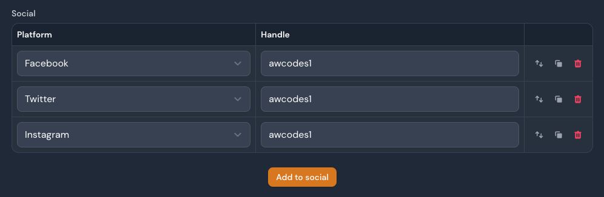
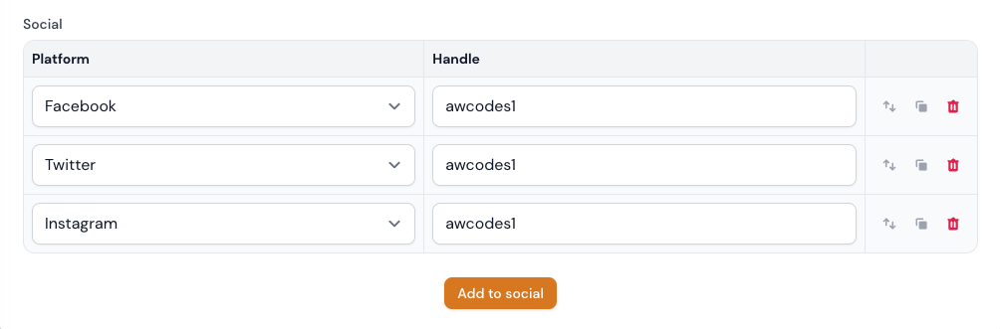

# Filament Table Repeater Plugin

[](https://packagist.org/packages/awcodes/filament-table-repeater)
[](https://github.com/awcodes/filament-table-repeater/actions?query=workflow%3A"Check+%26+fix+styling"+branch%3Amain)
[](https://packagist.org/packages/awcodes/filament-table-repeater)




## Installation

You can install the package via composer:

```bash
composer require awcodes/filament-table-repeater
```

## Usage

This field has most of the same functionality of the [Filament Repeater](https://filamentphp.com/docs/2.x/forms/fields#repeater) field. The main exception is that this field can not be collapsed.

```php
TableRepeater::make('social')
    ->schema([
        Select::make('platform')
            ->disableLabel()
            ->options([
                'facebook' => 'Facebook',
                'twitter' => 'Twitter',
                'instagram' => 'Instagram'
            ]),
        TextInput::make('handle')
            ->disableLabel(),
    ])
    ->columnSpan('full')
```

By default, Table Repeater will automatically create the table headers from your schema labels. This can be overridden by simply passing an array of your desired headers to the `->headers()` method.

```php
TableRepeater::make('social')
    ->headers(['Platform', 'Handle'])
    ->schema([
        ...
    ])
    ->columnSpan('full')
```

### Labels

To automatically hide all the labels of the fields in the table use the `->hideLabels()` method.

```php
TableRepeater::make('social')
    ->hideLabels()
    ->schema([
        ...
    ])
```

### Empty State Label

To customize the text shown when the table is empty, use the `->emptyLabel()` method.

```php
TableRepeater::make('social')
    ->emptyLabel('There is no platform registered.')
    ->schema([
        ...
    ])
```

### Without Header

Sometimes we don't want to have the table header at all. To achieve this, use the `->withoutHeader()` method.

```php
TableRepeater::make('social')
    ->withoutHeader()
    ->schema([
        ...
    ])
```

### Column Widths

To set the width of columns in the table use the `columnWidths()` method. 
Widths should be set in px as a string. 

```php
TableRepeater::make('social')
    ->columnWidths([
        'platform' => '200px',
    ])
    ->schema([
        Select::make('platform'), // will be 200px wide
        TextInput::make('handle'), // will be default stretched width
    ])
```

### Break Point

Below a specific break point the table will render as a set of panels to 
make working with data easier on mobile devices. The default is 'md', but 
can be overridden with the `breakPoint()` method.

```php
TableRepeater::make('social')
    ->breakPoint('sm') // accepts Tailwind CSS screen sizes
    ->schema([
        Select::make('platform'),
        TextInput::make('handle'),
    ])
```

## Theming

If you are using a custom theme for Filament you will need to add this plugin's views to your Tailwind CSS config.

```js
content: [
    ...
    "./vendor/awcodes/filament-table-repeater/resources/views/**/*.blade.php",
],
```

## Changelog

Please see [CHANGELOG](CHANGELOG.md) for more information on what has changed recently.

## Contributing

Please see [CONTRIBUTING](.github/CONTRIBUTING.md) for details.

## Security Vulnerabilities

Please review [our security policy](../../security/policy) on how to report security vulnerabilities.

## Credits

- [Adam Weston](https://github.com/awcodes)
- [All Contributors](../../contributors)

## License

The MIT License (MIT). Please see [License File](LICENSE.md) for more information.
